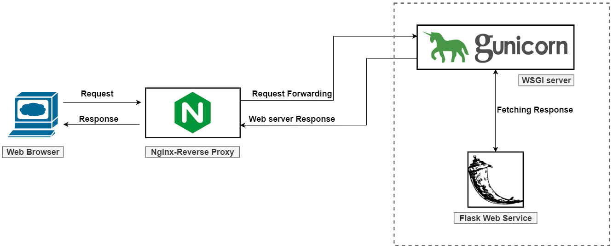

# Introduction
This is the repo for the [Wordify](https://wordify.unibocconi.it/index) web-app.

## Structure
Imagine hosting or deploying multiple web applications in production. One will have to carry out the following tasks: (i) handle static files if present, (ii) handle https connections, (iii) recover from crashes, (iv) make sure your application can scale up to serve multiple requests.

That sounds like a lot of work. But the good news is we can tools that take care of them. This web-app is composed by 3 core components:

- The [Flask](https://flask.palletsprojects.com/en/1.1.x/) app: Flask is a simple, lightweight WSGI* web application framework. It provides you with tools, libraries, and technologies that allow you to build a web service. It is a microframework designed to get started quickly and easily, with the ability to scale up to complex applications. If you want to learn Flask, you must check out this amazing [mega-tutorial](https://blog.miguelgrinberg.com/post/the-flask-mega-tutorial-part-i-hello-world)
    
    *WSGI is the Web Server Gateway Interface. It is a specification that describes how a web server communicates with web applications, and how web applications can be chained together to process one request. A WSGI middleware component is a Python callable that is itself a WSGI application - Gunicorn in our case. A WSGI component can perform functions like:
        
        - Routing a request to different application objects based on the target URL, after changing the environment variables accordingly.
        
        - Allowing multiple applications or frameworks to run side-by-side in the same process.
        
        - Load balancing and remote processing, by forwarding requests and responses over a network.

- The [Gunicorn](https://gunicorn.org/) application server: Gunicorn is a WSGI server. Gunicorn is built so that many different web servers can interact with it. It also does not care what you used to build your web application — as long as it can be interacted with using the WSGI interface. Gunicorn takes care of everything which happens in-between the web server and your web application. Gunicorns run multiple instances of your web application, making sure that they are healthy and restart them whenever needed, distributing incoming requests across those instances, and communicate with the webserver. A Gunicorn (WSGI) server is a must when an application is deployed in production.

- The [Nginx](https://www.nginx.com/) front-end reverse proxy: Nginx is a free, open-source, high-performance HTTP server. It also serves the purpose of reverse proxy, as well as an IMAP/POP3 proxy server. It is known for its stability, rich feature set, simple configuration, and low resource consumption. Nginx and Apache are the two best web servers to host a web application. In a computer network, a reverse proxy sits between a group of servers and the clients who want to use them. The reverse proxy directs all the requests from the clients to the servers and it also delivers all the responses from the servers to the clients. In our implementation, we will use Nginx as a reverse proxy server.

Roughly speaking, these components are collated together as follows: the web server (Nginx) accepts requests, takes care of general domain logic, and takes care of handling https connections. Only requests which are meant to arrive at the application are passed on toward the application server (Gunicorn) and the application itself (Flask).



## One-time Steps
Once you have a Flask app running locally, to put it in production you have to 

1. Configure a WSGI entry point: done in the `manage.py` file

1. Set up Gunicorn: what we have after step 1 is a flask application and a WSGI server script (`manage.py`). We need to bind this to the Gunicorn server so that Gunicorn can serve our application. We can do this by simply passing it the name of our entry point. This is constructed as the name of the module, plus the name of the callable within the application. In our case, this is manage:app’. Binding is still done on the default flask port 5000.

```bash
gunicorn --bind 0.0.0.0:5000 manage:app
```

We have tested that Gunicorn is able to serve our application, but we want something more robust for long-term usage. We can create a Gunicorn configuration file with the options we want, i.e. `app.ini`.

1. Configure the Service Unit file: this a crucial step. Let’s now create the `systemd` service unit file. Creating a systemd unit file will allow Linux’s init system to automatically start Gunicorn and serve the Flask application whenever the server boots. This is kind of automating the process by using a Daemon process in the background so that we don’t have to keep restarting the Gunicorn server every time we log in to our machines. We will create a `.service` inside `/etc/systemd/system`. I name the service file as `app.service` and it looks like this

```
[Unit]
Description=Gunicorn instance to serve app
After=network.target

[Service]
User=lesci
Group=nginx
WorkingDirectory=/home/lesci/wordify-webapp
Environment="PATH=/home/lesci/miniconda3/envs/wordify/bin" 
ExecStart=/home/lesci/miniconda3/envs/wordify/bin/gunicorn -c app_config.py -m 007 app:app

[Install]
WantedBy=multi-user.target
```

So, before we proceed further, let’s see what is this file for and what are the various parameters in it.

* [Unit]: This section, is used to specify metadata and dependencies. We a small description of our service here and tell the init system to only start this after the networking target has been reached.

* [Service]: The most important section. This will specify the user and group that we want the process to run under. I am giving my user account ownership of the process since it owns all of the relevant files. Let’s also give group ownership to the www-data group so that Nginx can communicate easily with the Gunicorn processes.

Next, we will add the working directory and set the PATH variable so that the init system knows that the executables for the process are located within our virtual environment. I have also specified the command to start the service. This command will start 3 worker processes and create and bind to a Unix socket file, nginx_gunicorn.sock, in our isolated project directory. Specify the WSGI entry point file name, along with the Python callable within that file (wsgi:app)

* [Install]: This will tell systemd what to link this service to when we enable it to start at boot time. We want this service to start when the regular multi-user system is up and running.

Note that I also provide a link to the `app_config.py` file which provides configuration options when starting up gunicorn.

We can now start the Gunicorn service we created and enable it so that it starts at boot:
```bash
sudo systemctl start app
sudo systemctl status app  # to monitor its status
```

1. Configure Nginx as Reverse Proxy: By the end of Step 6, our Gunicorn server is up and running. Now, we want the traffic from the outside world to be directed to the Gunicorn server but via the Nginx Reverse Proxy. The requests will be forwarded to the socket we have created in our directory. To begin with, install Nginx if it is not installed in the system.
```bash
sudo yum install nginx
```
We will write a fresh new server block inside the `/etc/nginx` directory which I name `nginx.conf`. For more info refer to [this tutorial](https://www.digitalocean.com/community/tutorials/how-to-serve-flask-applications-with-uwsgi-and-nginx-on-centos-7)

Remeber to keep the server name as the public IP of the system. Provide a complete path to the `app.sock` file on the isolated directory in the `proxy_pass`. When the Nginx server will receive requests, it will forward it to the Gunicorn server, which in turn will forward it to the socket file. The response will be fetched and delivered to the client. Restart the Nginx server by validating the syntax

```bash
sudo nginx -t  # to test the syntax
sudo systemctl restart nginx
```
Now, when we will hit the IP on the browser or do the curl operation on port 80 — the default HTTP protocol port, the response from the Flask web application will be served.

## Credits
This explanation follows closely the exposition presented [here](https://medium.com/@akash.mahale/serving-flask-applications-with-gunicorn-and-nginx-reverse-proxy-fe26217af226)

## Modify the app [WIP]
The steps to deploy a new version of the app are the following:

1. Substitute the `app/` folder with the updated version (once you check it works locally!)

1. Restart the `app.service`

```bash
sudo systemctl reload app  # reloads the app
```

if you modify the `app.ini` file, you also have to restart gunicorn

```bash
sudo systemctl daemon-reload  # restart gunicorn deamon
```

1. Restart Nginx

```bash
sudo systemctl restart nginx  # restart nginx
```
